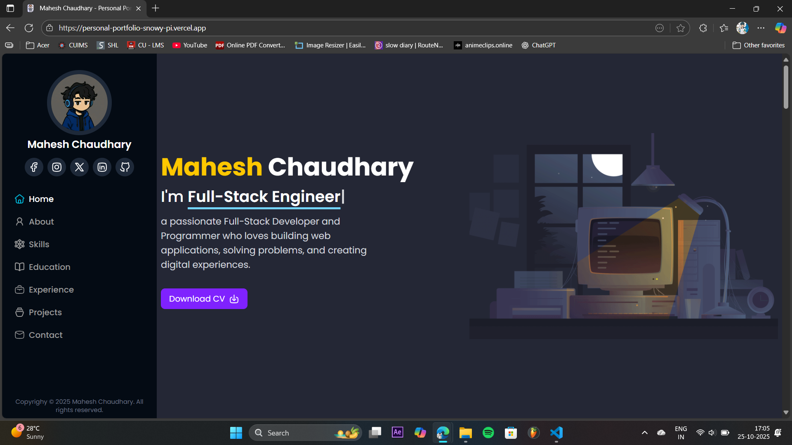
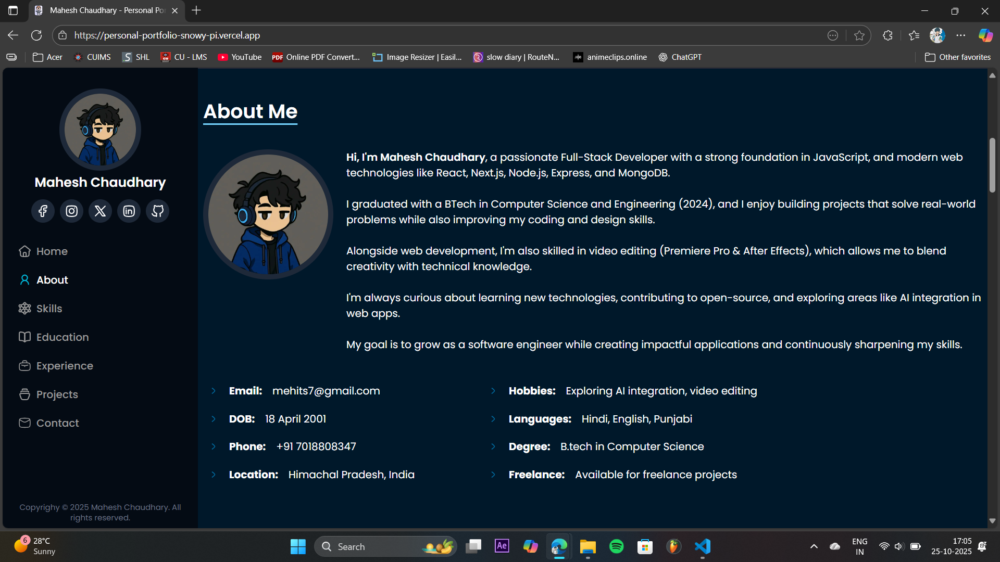
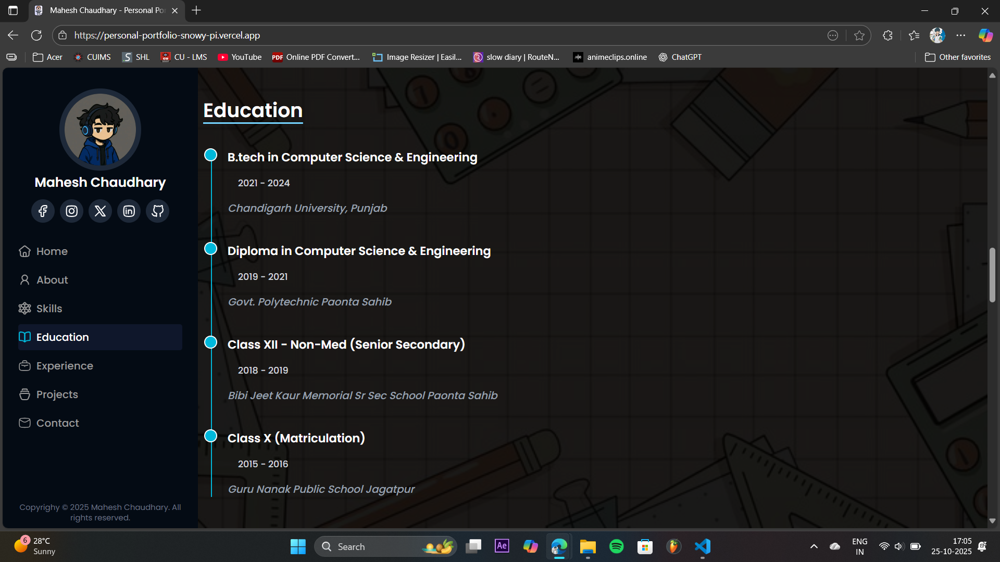
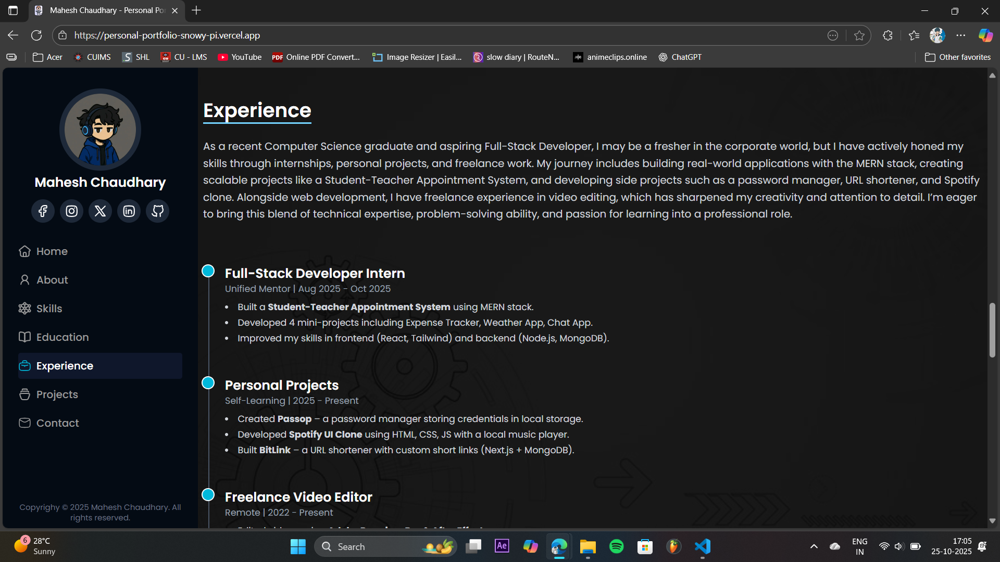
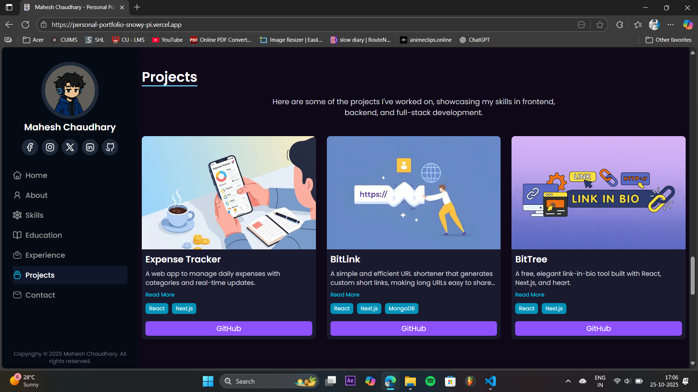
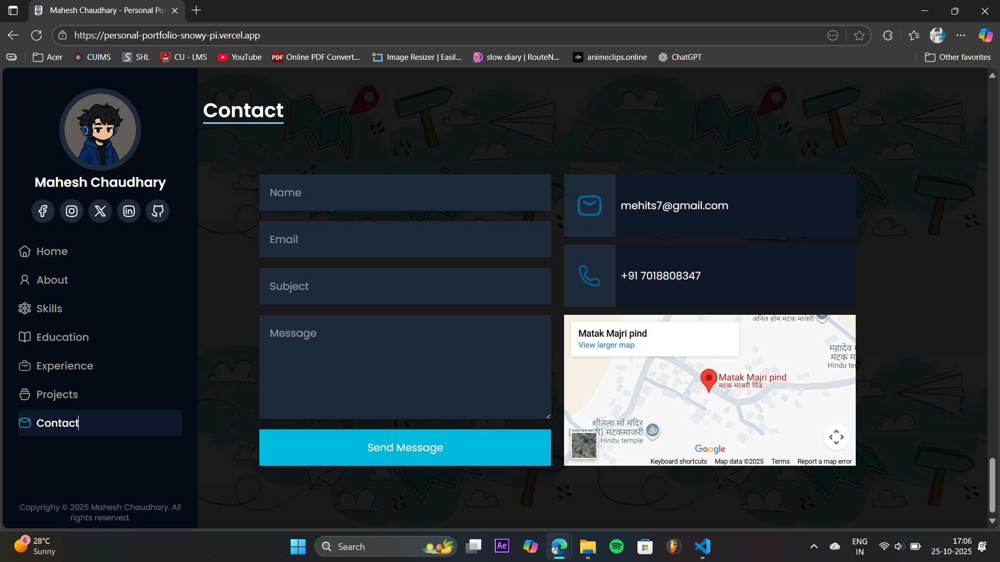

# Mahesh Chaudhary - Personal Portfolio 🚀  

This is my personal portfolio website built with **Next.js, React, Tailwind CSS, and Framer Motion**.  
It highlights my **skills, education, projects, experience, and contact details**.  

### 🌟 Features  
- Responsive and modern UI with Tailwind CSS  
- Smooth animations using Framer Motion  
- Dynamic typing effect with Typed.js  
- Active navigation highlighting with Intersection Observer  
- Contact form integration with Nodemailer (backend API)  
- Google Maps embed for location  
- Projects showcase with expandable descriptions  

### 🛠️ Tech Stack  
- **Frontend:** Next.js, React, Tailwind CSS, Framer Motion  
- **Backend:** Node.js (API for sending emails with Nodemailer)  
- **Others:** Typed.js, React-Scroll, React-Toastify  

### 📂 Sections  
- **Home** → Introduction with animated text  
- **About** → Bio, hobbies, languages, freelance availability  
- **Skills** → Tech stack with progress bars  
- **Education** → Timeline of qualifications  
- **Experience** → Internship, personal projects, freelance work  
- **Projects** → Showcased personal projects with GitHub links  
- **Contact** → Contact form + Google Maps location 

---

## ⚙️ Installation  

1. Clone the repo:  
   ```bash
   git clone https://github.com/maheshchaudhary845/Personal-Portfolio.git
   cd personal-portfolio
   ```

2. Install dependencies:
    ```bash
    npm install
    ```
3. Run the dev server:
    ```bash
    npm run dev
    ```
4. Open in browser:
    ```bash
    http://localhost:3000
    ```

---

## 🛜 Live Server (Deployed on Vercel)
https://personal-portfolio-snowy-pi.vercel.app/

---

# 📸 Screenshots

_Add screenshots of the app here (homepage, forecast section, etc.)_









---

### 📬 Contact Me  
- **Email:** mehits7@gmail.com  
- **LinkedIn:** [Mahesh Chaudhary](https://in.linkedin.com/in/maheshchaudhary845)  
- **GitHub:** [maheshchaudhary845](https://github.com/maheshchaudhary845)  

---
✨ Feel free to fork or star ⭐ this repo if you like the design!
